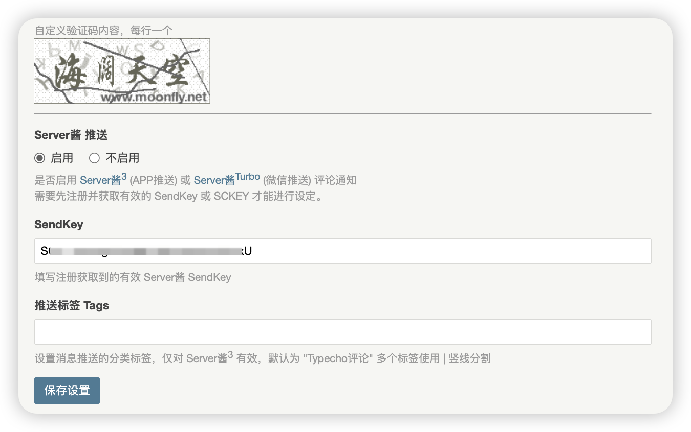

# Typecho-Captcha
Typecho专用验证码插件，支持中文、支持SAE

# 项目说明
本项目fork自 [Typecho-Captcha](https://github.com/KimiChen/Typecho-Captcha) 

因原作者已近 19 年没更新了，目前使用存在一些问题，因此我基于该代码做了简单的优化和修改，以支持在 Typecho 1.2.1 版本和 PHP 8 环境下正常使用。

# 功能更新

**2025.05.27 Update**
1. 新增 Server酱<sup>3</sup> 和 Server酱<sup>Turbo</sup> 的评论推送功能


**2025.03.05 Update**
1. 修复在 PHP 8 下 securimage 无法生成验证码图片(破图)的 bug
2. 新增设置验证码位数的配置选项，可自定义生成验证码的字符数量（仅对非中文验证码生效）
3. 新增了 ShortBaby.ttf 字体，对英文字母和数字验证码提供更好的显示效果

# 使用方法

1. [点击下载](https://github.com/m00nfly/Typecho-Captcha/zipball/master) 最新的插件代码zip包
2. 解压缩后，将其中的 `Captcha` 目录上传到 Typecho 的 `usr/plugins/` 目录下
3. 在 Typecho 后台的插件管理界面，启用 Captcha 插件，并设置验证码相关参数
4. 在 Typecho 主题的评论页面 php 代码文件的合适位置插入如下代码，显示图片验证码
```php
<?php Captcha_Plugin::output(); ?>
```

# 测试
| Typecho 版本     | PHP 版本  | 结果 |
|----------------|---------|----|
| Typecho v1.2.1 | PHP 8.0 | ✅  | 
